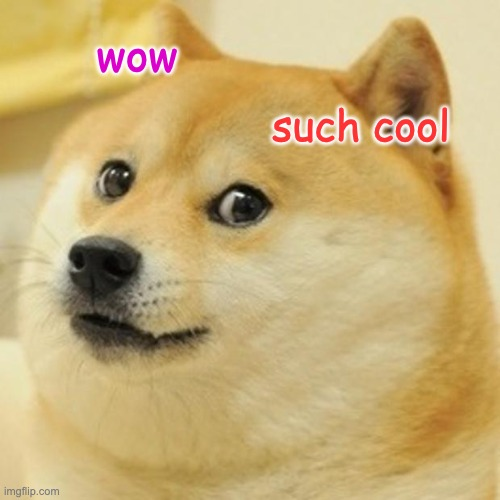

<!--
Add headers
Add an image
Add a code example
Make a task list
Merge your pull request
-->

WOW
===




```python

import hello

hello("World!")
```


Let's do it
---

- [x] EAT  
- [ ] SLEEP  
- [ ] REPEAT  
